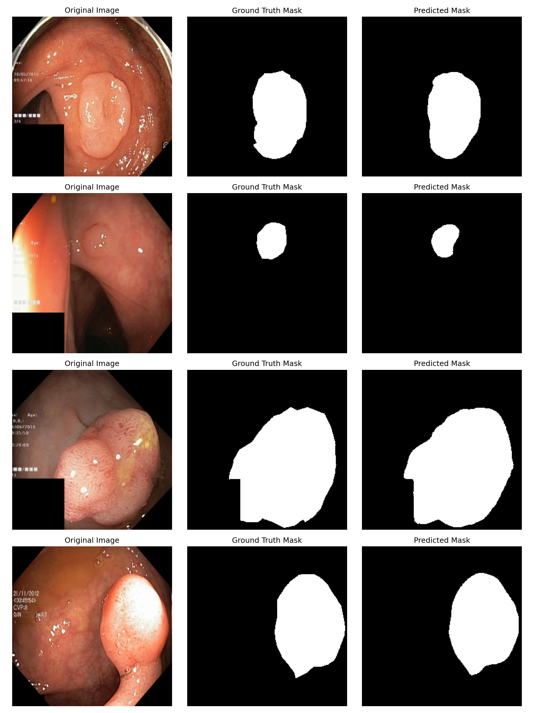

# Polyp Segmentation with U-Net

Бинарная сегментация полипов на колоноскопических снимках с помощью U-Net + ResNet34.  
Трекинг экспериментов — **MLflow**.



---

## Результаты обучения

| Метрика | Значение |
|---|---|
| Best Val Dice | **0.9026** |
| Best Val Loss | **0.0942** |
| Эпох | 30 |

---

## Датасет

[Kvasir-SEG](https://www.kaggle.com/datasets/abdallahwagih/kvasir-dataset-for-classification-and-segmentation) — 1000 колоноскопических снимков с масками полипов, размеченными врачами.

- 800 изображений — обучение
- 200 изображений — валидация

---

## Архитектура

```
Входное изображение [3, 256, 256]
        ↓
   Энкодер: ResNet34 (предобучен на ImageNet)
   256×256 → 128×128 → 64×64 → 32×32
        ↓
   Декодер: U-Net decoder со skip connections
   32×32 → 64×64 → 128×128 → 256×256
        ↓
   Выходная маска [1, 256, 256]
```

---

## Структура проекта

```
polyp-segmentation/
├── config.py       # гиперпараметры и настройки MLflow
├── dataset.py      # загрузка данных и аугментации
├── model.py        # архитектура U-Net
├── train.py        # цикл обучения с MLflow-логированием
├── evaluate.py     # визуализация результатов
└── results.png     # примеры предсказаний
```

---

## Гиперпараметры

| Параметр | Значение |
|---|---|
| Image size | 256×256 |
| Batch size | 8 |
| Epochs | 30 |
| Learning rate | 1e-4 |
| Optimizer | Adam |
| Loss | BCEWithLogitsLoss |
| Val split | 20% |

---

## Аугментации (train)

- Horizontal Flip (p=0.5)
- Vertical Flip (p=0.5)
- Random Rotate 90° (p=0.5)
- Normalize (ImageNet mean/std)

---

## Запуск

**Установка зависимостей:**
```bash
pip install torch torchvision opencv-python albumentations scikit-learn segmentation-models-pytorch matplotlib tqdm mlflow
```

**Путь к датасету** задаётся через переменную окружения (по умолчанию `~/Downloads/archive/kvasir-seg/Kvasir-SEG`):
```bash
export DATA_DIR=/path/to/Kvasir-SEG
```

**Обучение:**
```bash
python train.py
```

**MLflow UI** — откройте в браузере после обучения:
```bash
mlflow ui
# http://localhost:5000
```

В UI доступны:
- графики `train_loss`, `train_dice`, `val_loss`, `val_dice` по каждой эпохе
- все гиперпараметры эксперимента
- лучшая модель (`best_model.pth`) как артефакт

**Визуализация предсказаний:**
```bash
python evaluate.py
```
